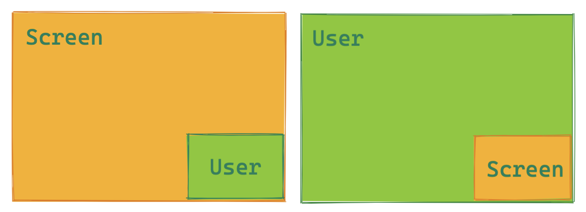
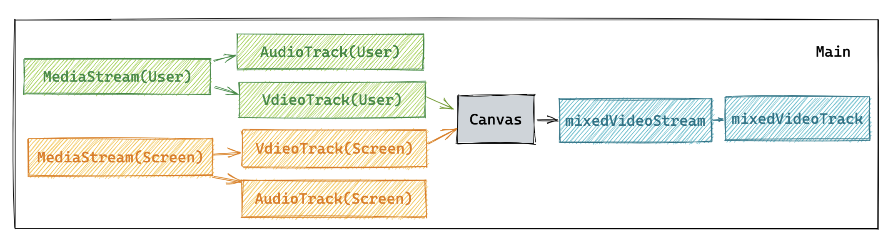
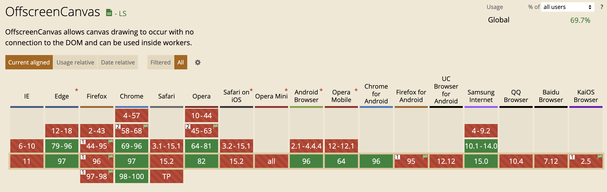
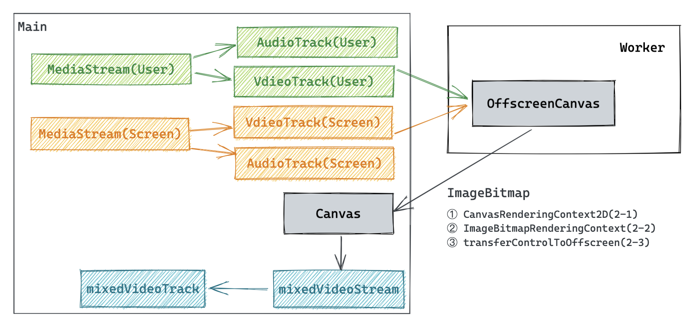
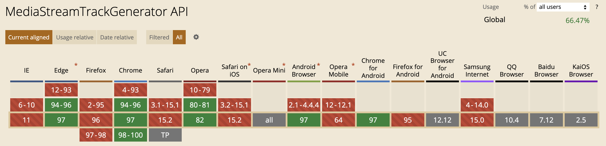
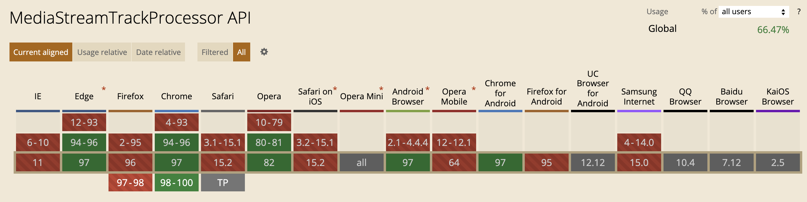

# 3 种 WebRTC 混合本地视频流方案

## 背景

当用户使用 WebRTC 进行音视频通话的时候，很多时候会同时开启摄像头和屏幕分享，或者其他种类自定义媒体流。因此用户可能会对两路及两路以上视频流进行推流。

最常见的场景可能如下图所示的，用户同时开启自己的摄像头和屏幕分享：

当本地同时推两路视频流时，发送端和接收端都会增加带宽消耗。如果我们想降低带宽成本的话，最常见的方案是把两路视频流混合，只推流一路或者拉取一路，这样就可以降低很多带宽使用了。

接下来会介绍几个方法来介绍，如何不依赖后端，在浏览器本地实现本地混合视频流。

本文的代码仓库地址：[点击访问](https://github.com/zhangyuiris/3-ways-to-mix-video-tracks-with-javascript) 。

# 方案一: 使用 Canvas 来绘制两路视频流

## 实现思路：

- 采集摄像头的视频流
- 采集屏幕分享的屏幕流
- 将两路视频流绘制在 Canvas 上
- 从 Canvas 采集混合后的视频流
- 传输视频流...

## Demo

点击访问 [Demo](https://mix-video-tracks.vercel.app/1_Canvas.html) 。

# 方案二: OffScreenCanvas + Worker 通信视频帧

`OffscreenCanvas` 提供了一个可以脱离屏幕渲染的 `Canvas` 对象。它在 `window` 和 `Web Worker` 环境均有效。是一个实验中的新特性，主要用于提升 Canvas 2D/3D 绘图应用和 H5 游戏的渲染性能和使用体验。

## 实现思路：

- 采集摄像头的视频流
- 采集屏幕分享的屏幕流
- 在 Worker 线程中，创建一个 OffscreenCanvas
- 将视频流和屏幕流的当前画面转换成 ImageBitmap 对象传递给 Worker
- OffscreenCanvas 绘制完成后创建 ImageBitmap 对象，把 ImageBitmap 对象传递给主线程中
- 主线程接收到 ImageBitmap 对象之后，把 ImageBitmap 绘制到 Canvas 对象上
- 从 Canvas 采集混合后的视频流
- 传输视频流...

在 2-1 的 demo，使用 Canvas 的 CanvasRenderingContext2D 上下文

在 2-2 的 demo，使用 Canvas 的 ImageBitmapRenderingContext 上下文

在 2-3 的 demo，使用 Canvas 的 transferControlToOffscreen

## Demo

点击访问：[2-1](https://mix-video-tracks.vercel.app/2_1_OffscreenCanvas.html)， [2-2](https://mix-video-tracks.vercel.app/2_2_OffscreenCanvas.html)， [2-3](https://mix-video-tracks.vercel.app/2_3_OffscreenCanvas.html)

# 方案三：使用 WebRTC Insertable Streams + Worker

WebRTC Insertable Streams 增加了一些新 API，让开发者对媒体数据可以做如下的事：

- 允许用户不打破 WebRTC 正常处理 pipeline ，手动处理数据
- 允许使用 WASM 技术进行数据处理
- 允许使用 Web Worker 技术处理数据，避免阻塞主线程
- 允许端到端间进行数据加解密，避免安全以及隐私泄露风险（在不信任 SFU 服务器的情况下，避免中间人攻击）

MediaStreamTrack 的数据可以被 MediaStreamTrackProcessor 消耗，然后对外暴露 ReadableStream ：

- 如果是 VideoTrack，你将访问到 [VideoFrame](https://w3c.github.io/webcodecs/#videoframe) 对象
- 如果是 AudioTrack，你将访问到 [AudioData](https://w3c.github.io/webcodecs/#audiodata-interface) 对象，

MediaStreamTrackGenerator 可以创建一个 WritableStream，generator 也可以作为 MediaStreamTrack 的 source。

我们可以使用 TransformStream 在 ReadableStream 和 WritableStream 之间流式传输数据，流程图如下：

一些 API 的兼容性：

## 实现思路

- 采集摄像头的视频流
- 采集屏幕分享的屏幕流
- 生成两路流的 processor
- 将两路流 readable 的数据传输给 Worker
- 将两路流的 videoFrame 绘制在 Canvas 上
- 从 Canvas 获取最新的 videoFrame 生成最终的视频流
- 传输视频流...

## Demo

点击访问 [Demo](https://mix-video-tracks.vercel.app/3_Insertable%20Stream.html) 。

# 补充

## API 的兼容性

OffscreenCanvas 目前在 Chrome 69 /Edge 79 版本之后支持

Insertable Streams 目前在 Chrome/Edge 94 版本之后支持

所以在实际使用的时候需要考虑到各个浏览器的兼容性
